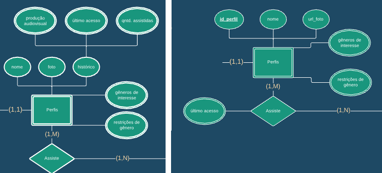
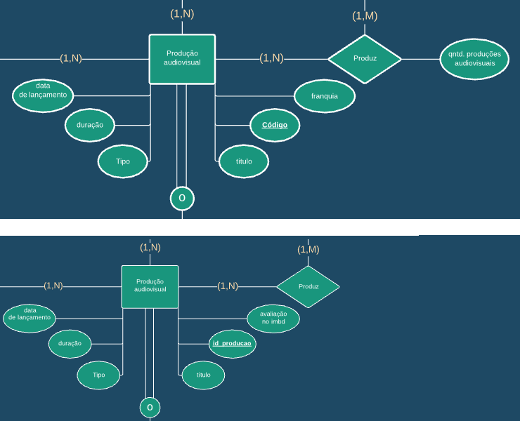
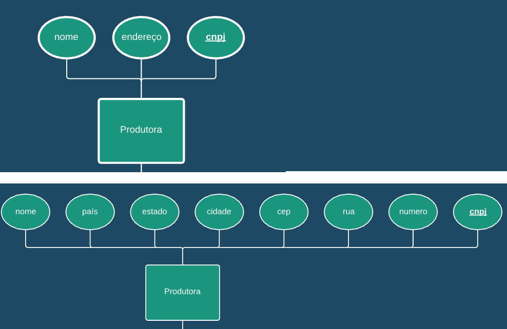
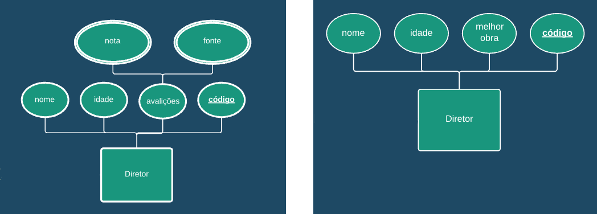
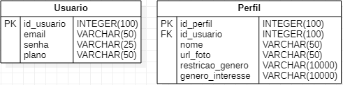

# Projeto "FeiFlix"

## Integrantes do Grupo 3

- Andy Silva Barbosa
  - RA: 22.218.025-9

- Rafael Zacarias Palierini
  - RA: 22.218.030-9

- Rubens de Araújo Rodrigues Mendes
  - RA: 22.218.009-3

- Vitor Acosta da Rosa
  - RA: 22.218.006-9

## UdD - Universo de Discurso escolhido

O sistema desenvolvido apoia-se na ideia de um serviço de *streaming,* permitindo acesso a uma grande quantidade produções audiovisuais como: filmes, séries e documentários; sem a necessidade de *download* por parte do usuário ou a obtenção de mídias físicas, garantindo ao usuário final do sistema o acesso mais flexível e rápido aos serviços. Atualmente, existem diversas empresas que prestam a função de *streaming* de mídias audiovisuais, como a Netflix, Amazon Prime, Telecine Play, HBO GO, entre outras. E, cada vez mais, esse mercado vêm crescendo, abrangendo até mesmo o mercado de *games*, como o Google Stadia e o novo Amazon Luna. 

## Objetivo do sistema do UdD

O objetivo principal do sistema é organizar uma plataforma de *streaming* idealizada pelo grupo. Nesse contexto, existe o gerenciamento de usuários, bem como os perfis que podem ser criados por cada usuário, além de, claro, apresentar as produções audiovisuais e informações de alta relevância sobre elas, como por exemplo títulos, franquias, durações, gêneros e referências dos bastidores, como os atores e diretores envolvidos na produção. De forma a exibir, em sua completude, os dados que compõem uma única mídia audiovisual.

## Funcionalidades do sistema do UdD

Assim como as grandes empresas que participam do ramo de *streaming*, o primeiro passo do sistema idealizado emprega uma autenticação de usuário, isso é, há a necessidade prévia de cadastro de email, senha e plano, esse último é referente ao pacote escolhido pelo usuário, o que impacta na qualidade e flexibilidade do uso.

Após essa identificação, o usuário poderá criar perfis e gerencia-los. Diferentemente dos outros serviços já existentes no mercado, o usuário poderá criar quantos perfis ele desejar nessa plataforma. 

Cada perfil contará essencialmente com um nome e uma foto, o usuário poderá também informar seus gêneros de interesse e restrições, para que o serviço se adapte aos gostos e preferências de cada cliente, visando a maior qualidade e objetividade ao acessar o sistema. 

Além disso, todo perfil possui um histórico composto por: produções audiovisuais assistidas, bem como as quantidades de visualizações e a última vez a qual aquele utilizador acessou tal produção. 

Esse histórico alavancará em uma das utilidades do sistema, retomar e relembrar os títulos já visualizados em cada perfil, facilitando o reacesso às mídias.

O alicerce do sistema baseia-se na produção audiovisual em si. A funcionalidade principal é o acesso as informações relacionadas à alguma mídia requisitada pelo usuário, retornando dados relevantes como título, data de lançamento, duração, franquia e tipo (*live-action* ou animação). Pensando nos devotos por cinema, é possível visualizar, além de todos os dados citados de uma única mídia, informações sobre produtora do título, bem como quantas obras foram feitas por ela, roteiristas, atores e diretores envolvidos.

Por fim, vale ressaltar que, cada produção audiovisual pode ser um filme, documentário ou série. Tal distinção reflete uma funcionalidade importante implementada no sistema, um filtro. Através dele, o usuário poderá acessar mais fácil e rapidamente informações sobre cada uma dessas categorias, por exemplo, o cliente será capaz de ver a quantidade de temporadas e gêneros de sua série favorita, também é possível buscar o tema de interesse nos documentários da plataforma. Dessa forma, os filtros existem para trazer praticidade ao usuário no quesito de busca de títulos para assistir.

# Etapa 2 - Revisão da Modelagem, Projeto Lógico da Base de Dados e Implementação

## Alterações do diagrama ER

Para a correta criação do modelo relacional utilizando a ferramenta **StarUML**, foi necessário alterar alguns atributos, entidades e também relacionamentos previamente idealizados na modelagem conceitual, visando mapear, de forma mais concisa e objetiva, toda a estrutura desenvolvida.

Nesse contexto, houve as seguintes alterações:

### Entidade "Perfil"

A entidade perfil sofreu alterações em alguns atributos:

- Foi adicionado um ID único para todo usuário, a fim de manter as tuplas do banco de dados normalizadas.
- Além disso, o atributo "foto" foi alterado para "url_foto", isso porque é inviável armazenar a imagem de cada perfil do serviço no banco de dados. Nesse contexto será armazenado somente um varchar: a url, a localização, o caminho do servidor até a imagem;
- A grande mudança foi referente ao atributo composto "histórico", a sua idealização, na primeira etapa, consistia em um atributo composto por três atributos multivalorados: a produção audiovisual assistida, o último acesso à essa produção e a quantidade de vezes assistidas; Algo que, além de não normalizado, mostrava-se complexo para armazenar no banco.

    Nessa perspectiva, o histórico será dado através da **própria relação** entre a entidade perfil e produção audiovisual, haja vista que, essa relação gerará um atributo, multivalorado, "último acesso". Através dele é possível visualizar a última vez que o usuário acessou uma certa produção audiovisual, bem como os dados dessa produção e, por ser um atributo que irá armazenar todos os acessos do usuário àquela produção, é possível contar a quantidade de entradas a um determinado filme/série/documentário.

- Toda essa mudança é visível abaixo:



Figura 1 - À esquerda a entidade idealizada na etapa 1. À direita, a mesma entidade após alterações na etapa 2

### Entidade "Produção Audiovisual"

A entidade da produção audiovisual, a entidade central construída pelo grupo sofreu alterações em seus atributos e em algumas relações:

- O atributo código que era uma chave primária única para cada produção teve o nome alterado para ID_Produção.
- O atributo "franquia" foi alterado para avaliação no imdb. Na primeira etapa o atributo franquia teria como objetivo mostrar o "universo" do filme. Entretanto, como a entidade passa pelo processo de "overlapping", esse atributo teria diversos valores nulos (caso o tipo da obra fosse um documentário ou até mesmo uma série) . No lugar, foi adicionado a avaliação no imdb do filme, que tem a função de retornar um valor: a nota do filme.
- Além disso, a relação entre produção audiovisual e produtora, "Produz", na primeira etapa tinha um atributo que seria gerado, a "quantidade de produções audiovisuais", entretanto, esse atributo mostrou-se descartável já que, para contar quantas obras foram criadas por uma determinada produtora basta contar quantas vezes uma determinada produtora aparece nos registros:

    ```sql
    SELECT produtora.nome,
           COUNT(produtora.nome) as producoes_realizadas
    FROM produtora
    INNER JOIN prod_audio_produtora
    ON produtora.cnpj = prod_audio_produtora.cnpj
    GROUP BY (produtora.nome)
    ORDER BY producoes_realizadas DESC
    ```

- Tais alterações são visíveis abaixo:

    

    Figura 2 - A imagem acima é referente à etapa 1, abaixo, a mesma entidade porém com as alterações realizadas na segunda etapa.

### Entidade "Produtora"

A entidade referente aos dados da produtora de uma determinada obra teve mudanças principalmente em seus atributos.

- O atributo endereço, idealizado na primeira etapa, foi substituído por atributos atômicos, a saber: país, estado, cidade, CEP, rua e número. Alteração feita visando normalizar o banco.
- As mudanças são visíveis abaixo:



Figura 3 - A imagem acima é referente à Produtora idealizada na etapa 1, já a imagem abaixo é referente à entidade envolvendo somente atributos atômicos (etapa 2).

### Entidade "Diretor"

A entidade diretor, sofreu alterações somente em seus atributos.

- O atributo "avaliações" que era um atributo composto formado por outros dois atributos multivalorados, mostrou-se inviável em sua implementação, pois geraria diversos dados em uma única coluna, sobrecarregando as tuplas dessa entidade.
Nessa perspectiva, foi removido tal atributo e inserido o atributo "melhor obra". Perceba que, como a melhor obra do diretor estará marcada, é possível pela entidade de produção audiovisual, acessar sua classificação (através do atributo já citado "avaliação do imbd"). Além disso, caso o usuário deseje ver todas as obras de um determinado diretor, é possível observar a avaliação de todas as obras.
- Essa alteração pode ser vista abaixo:

    

    Figura 4 - A imagem à esquerda faz jus a entidade idealizada na etapa 1, já a imagem à direita mostra as alterações realizadas na etapa 2 do projeto.

## Mapeamento do MER para o modelo relacional

Após todas as alterações na base do modelo de entidade de relacionamento (MER), foi necessário mapear as relações e interligar os dados de diferentes tabelas. Após o mapeamento houve como resultado a criação de 15 tabelas, um número esperado, já que 83.3% (5) das relações eram de muitos para muitos (M..N), e também, nosso MER possuía um Overlap.

### Tratamento do Overlap na entidade "Produção Audiovisual"

Cada entidade que passava pelo processo de "overlapping" virou uma tabela, contendo os atributos originais idealizados na etapa 1 mais uma chave estrangeira com o código da produção responsável por ligar as tabelas. Nesse contexto, as entidades filme, série e documentário foram transformadas em tabelas.

### Relações um para muitos 1..N

A única relação de todo o banco idealizado que possuía o tipo 1..N era a relação "Possui", que ligava as entidades "Usuário" e "Perfil".

Para mapear essa relação, bastou incluir como chave estrangeira na entidade participante (no caso a entidade "Perfil") a chave primária da entidade "Usuário". Dessa forma, a entidade "Perfil", além de todos seus atributos, recebeu uma chave estrangeira "id_usuário", para referenciar sua relação com a entidade "Usuário".



Figura 5 - Atribuição de chave estrangeira para a entidade "Perfil".

### Relações muitos para muitos M..N

Correspondente à maior parte das relações de todo o banco, tem-se as relações que ligam as entidades:

- Perfil e Produção Audiovisual
- Produção Audiovisual e Produtora
- Produção Audiovisual e Ator
- Produção Audiovisual e Diretor
- Produção Audiovisual e Roteirista

Todas elas obedeceram o seguinte: Para cada relação M..N, foi criado uma nova tabela com os atributos sendo as chaves primárias de cada entidade participante desse relacionamento, bem como, se existir, os atributos gerados por aquela relação.

Logo, todas relações citadas acima, foram transformadas em tabelas.

Portanto, após transformar as relações em novas tabelas, o modelo relacional feito através da ferramenta StarUml resultou em:


Figura 6 - Modelo relacional após mapear todo o MER.

Perceba que, as linhas pontilhadas evidenciam como as entidades se comunicam entre si, além disso, em verde é possível visualizar todas as relações N..M que tornaram-se novas tabelas e garantiram a interligação entre todos os dados.

## Consulta pedida

A query pedida pela professora foi: "Quais foram os top 5 itens mais vistos no ano de 2020. Indicar o título, tipo da obra e avaliação média no imdb dos atores das respectivas obras." O grupo decidiu separar em partes toda essa query, uma vez que são utilizadas quatro tabelas para retornar o resultado esperado.

Essa consulta ocasionou em diversos problemas, sendo o principal deles a multiplicação das funções de agregação (no caso, o COUNT do top 5) ao realizar o JOIN com as demais tabelas, algo que já era esperado, uma vez que, ao realizar o JOIN é feito o produto cartesiano entre as tuplas.

Para contornar esse problema, o grupo decidiu fazer a query proposta partindo das notas médias do IMDB dos atores (pois envolveria somente o AVG, uma função de agregação não afetada pelos JOINs) e avançando para os dados sobre a produção e por fim estruturar o top 5.

O primeiro passo foi realizar a ligação entre a tabela de atores com a tabela intermediária prod_audio_ator, na qual o id_ator deveria ser igual em ambas. Esse primeiro "salto" foi feito através de um INNER JOIN.

```sql
SELECT
ROUND(AVG(act.nota_imdb_ator)::numeric,2) as "Média de notas IMDB dos atores", --Média das notas
prod_auvi.titulo as "Título da produção", --Título da obra
prod_auvi.tipo as "Tipo da produção", --Tipo da obra
prod_auvi.nota_imdb as "Nota IMDB da produção", --Opcional do grupo: nota da obra
ppqnt.Vezes_Assistidas --Quantidade de vezes que a produção foi assistida (necessário para o top 5)
FROM ator act

INNER JOIN prod_audio_ator prod_auvi_act    -- Primeira ligação: Tabela ator com a
ON act.id_ator = prod_auvi_act.id_ator  -- tabela de relacionamento prod_audio_ator
```

O segundo passo foi interligar a tabela de relação prod_audio_ator com a tabela principal das produções audiovisuais, adquirindo assim dados como o título, tipo e nota IMDB dessas obras, esse processo foi simples, necessitando somente a construção de um outro INNER JOIN.

```sql
INNER JOIN prod_audiovisual prod_auvi                    -- Após adquirir os IDs de cada ator,
ON prod_auvi_act.id_producao = prod_auvi.id_producao -- liga os atores a produção audiovisual
```

Após isso, seria necessário ligar a tabela de produção audiovisual com "perfil_prod" para criar então o top 5.

Nesse ponto, tivemos o desafio. Como agrupar as produções que mais foram vistas sem ocorrer a multiplicação das tuplas?

Era conhecido que para adquirir os top 5 itens mais vistos no ano 2020, bastava contar os dados existentes na tabela "perfil_prod" e agrupar pelo próprio id da produção, limitando, é claro a data de acessos para somente o ano de 2020, nessa perspectiva já tínhamos o seguinte:

```sql
SELECT COUNT(perf_prod.id_producao) as Vezes_Assistidas,
perf_prod.id_producao
FROM public.perfil_prod perf_prod
WHERE EXTRACT(year FROM perf_prod.ult_acesso)='2020' --Limita que a data de acesso seja somente em 2020
GROUP BY perf_prod.id_producao
```

Bastou então ligar esse select à um RIGHT JOIN (foi escolhido o right join pois os dados predominantes estavam vindo das relações anteriores, a saber, os dados sobre a nota média IMDB dos atores, o título da produção, o tipo e a nota IMDB da produção). Nessa perspectiva, tínhamos a ligação do top 5 com todo o resto:

```sql
RIGHT JOIN
(SELECT COUNT(perf_prod.id_producao) as Vezes_Assistidas,
perf_prod.id_producao
 FROM public.perfil_prod perf_prod
 WHERE EXTRACT(year FROM perf_prod.ult_acesso)='2020' --Limita que a data de acesso seja somente em 2020
 GROUP BY perf_prod.id_producao) ppqnt

 ON(ppqnt.id_producao = prod_auvi.id_producao) --Liga o ID da produção da entidade prod_audiovisual com perfil_prod
```

Por fim, bastou agrupar os dados pela quantidade de vezes assistidas, o título, o tipo e a nota IMDB da obra e ordenar com base nas vezes assistidas de forma descendente e limitada por  tuplas.

Toda a query, ficou da seguinte forma:

```sql
SELECT
ROUND(AVG(act.nota_imdb_ator)::numeric,2) as "Média de notas IMDB dos atores", --Média das notas
prod_auvi.titulo as "Título da produção", --Título da obra
prod_auvi.tipo as "Tipo da produção", --Tipo da obra
prod_auvi.nota_imdb as "Nota IMDB da produção", --Opcional do grupo: nota da obra
ppqnt.Vezes_Assistidas --Quantidade de vezes que a produção foi assistida (necessário para o top 5)
FROM ator act

INNER JOIN prod_audio_ator prod_auvi_act    -- Primeira ligação: Tabela ator com a
ON act.id_ator = prod_auvi_act.id_ator  -- tabela de relacionamento prod_audio_ator

INNER JOIN prod_audiovisual prod_auvi                    -- Após adquirir os IDs de cada ator,
ON prod_auvi_act.id_producao = prod_auvi.id_producao -- liga os atores a produção audiovisual

RIGHT JOIN
(SELECT COUNT(perf_prod.id_producao) as Vezes_Assistidas,
perf_prod.id_producao
FROM public.perfil_prod perf_prod
WHERE EXTRACT(year FROM perf_prod.ult_acesso)='2020' --Limita que a data de acesso seja somente em 2020
GROUP BY perf_prod.id_producao) ppqnt

ON(ppqnt.id_producao = prod_auvi.id_producao) --Liga o ID da produção da entidade prod_audiovisual com perfil_prod

GROUP BY (ppqnt.Vezes_Assistidas, prod_auvi.titulo, prod_auvi.tipo, prod_auvi.nota_imdb)
ORDER BY ppqnt.Vezes_Assistidas DESC LIMIT 5 --Top 5 (maior para o menor)
```

Essa consulta resultou nos seguintes dados:


